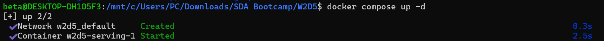
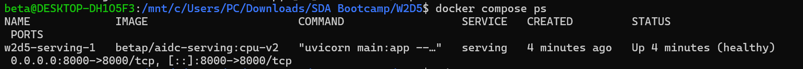
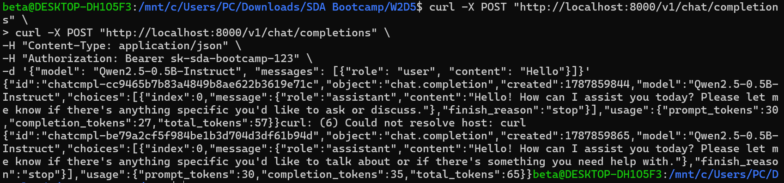
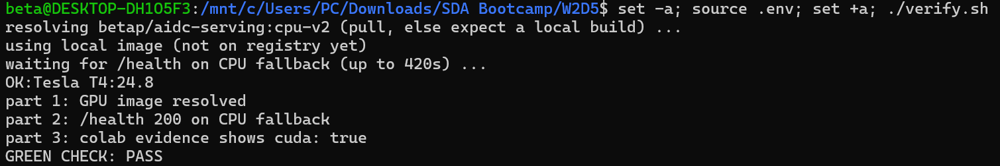

# Lab W2D5: compose and teams
| Question | Prediction |
| :--- | :--- |
| Seconds until `docker compose ps` reports healthy | 120s |
| Does changing `MODEL_ID` in `.env` and re-running `up -d` recreate the container? | Yes |
| Does the base image have `curl`? | No |
| Hours/days/weeks until someone else generates tokens on an unkeyed public port | Hours |
| Which endpoint must still answer without a key after step 4, and why? | `/health` |

# Verification

Docker Compose Up

Container Health Status

API Request

Final Verification (GREEN CHECK)

