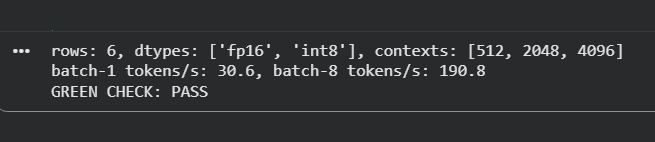

# Lab W3D1: Profile Inference on a Real GPU

## Predict (By Hand)
* **Weights only (fp16 - 2 bytes):** 4.0 GB
* **Weights only (int8 - 1 byte):** 2.0 GB
* **Resident VRAM (512 context, fp16):** 4.5 GB
* **Resident VRAM (4096 context, fp16):** 8.0 GB *(Larger by ~3.5 GB)*
* **GPU Utilisation (single-request decode):** 90% 

## Verification
Matrix profiling completed and efficiency verified.

